This is the readme for the model that was used in the paper

SST interneurons facilitate dendritic calcium signaling via tonic
activation of alpha5-GABA receptors (2026) Chiayu Q. Chiu*, Thomas
M. Morse*, Karima AitOuares, Lauren C. Panzera, Paras A. Patel,
Francesca Nani, Frederic Knoflach, Maria-Clemencia Hernandez, Monika
Jadi, Michael J. Higley. *Neuron*. [doi:10.1016/j.neuron.2026.04.017](https://doi.org/10.1016/j.neuron.2026.04.017)

The original Iascone et al model was edited to study tonic
GABAARs (tGARs). Changes included adding a tGAR mechanism,
`ex_GABALeak`, modifying the leak conductance and reversal potential,
adding calcium channels to the dendrites and otherwise simplifying
the voltage gated channels distribution. For full details see the
paper and the model code provided in this archive.

This model used [NEURON](https://neuronsimulator.org) (8.2.2)
and [python](https://python.org) (3.10.12) and was run with
the indicated versions and should run with similar versions as it
doesn't use anything unique to these. The code was run under the
Ubuntu (linux) 24.04 and MacOS Tahoe 26.2 operating systems and a
few versions prior to those.

For guidance on running the model interactively load this archive’s
interactive.html into a browser (on modeldb you can browse “files”
to view `interactive.html` online).

## To generate figures in the paper

The paper's Figure 2A can be generated by running the linux shell script

    ./configure_and_run.sh

or

    time ./configure_and_run.sh &> job_output.txt

which takes about 2 minutes and 40 seconds to run on a 2019
MacBook.

The figures appear in a results/figs subfolder.  In Fig 2A top, the
overlaid current clamp stimulus pulse was scaled so that its 0.6 nA
height is displayed as 6 mV. To avoid artifacts the current pulse is
turned off when the membrane voltage passes 0 mV.

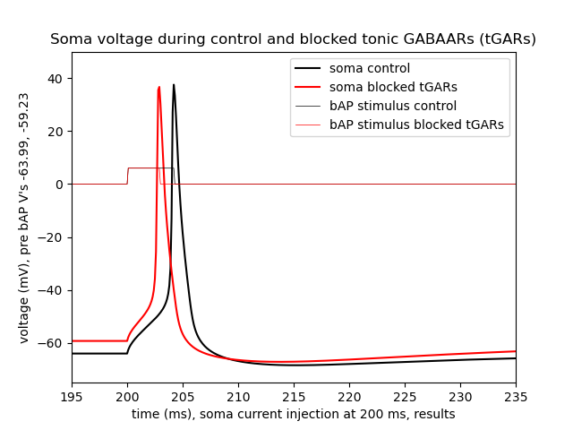

Fig 2A (bottom):

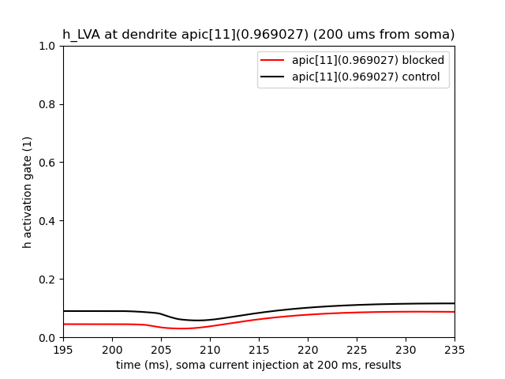

Part of the data that went into making into Fig 2B (the -64 mV
average row) was also created (in the `results/ca_suppr` subfolder):

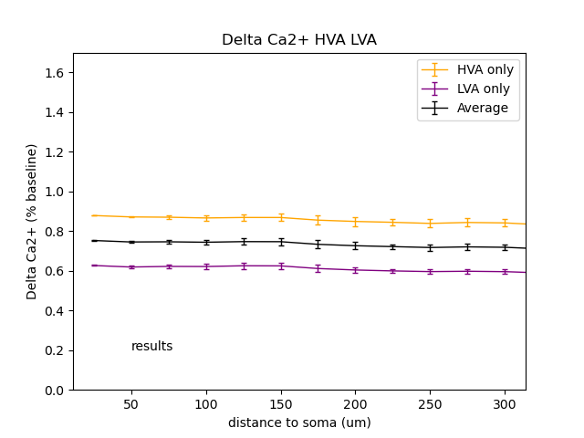

Reminder: The delta Ca2+ modeling definition: first
calculate the sum of each recorded dendritic locations calcium
current in a 20 ms window following the detection of the soma action
potential in the two conditions (simulations) of control (baseline)
and blocked tonic GABAA receptors.  Divide the blocked sum by the
control sum.

Note: to calculate all the rows of data in Fig 2B run
`./sensitivity_depol_iclamp.sh` as discussed below.

##  sensitivity of calcium suppression to pre-bAP baselines

A Ca2+ suppression sensitivity analysis is performed with current
clamps of persistent depolarizing currents that reaches pre-bAP
baseline voltages of -70, -68, -66, -64, -62, -60 mV in the control
case with the same current clamp amplitudes in the blocked tonic
GABAAR case. The results (takes about 22 minutes on a 2019 MacBook)
are stored in a subfolder specified as an assignment (also in the
below sh script) to `base_dir_name`:

    ./sensitivity_depol_iclamp.sh

The output of the above shell script is plotted with the below python script:

    python3 -i plot_fig2B.py

which recreates a similar plot to Figure 2B:

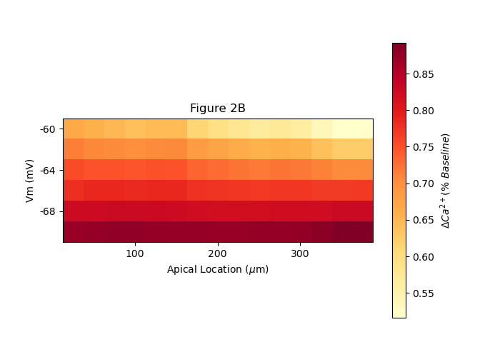

To plot a comparison of delta Ca suppression between these
simulations (by retrieving data from the base_dir_name folders) at
200 um's from the model soma run:

    python3 -i explore_depol_iclamp.py

(Note if specific modifications are made to the code including
base_dir_name in the sensitivity... sh scripts then the
explore... scripts have to have the new name provided in the
`date_string` (must match `base_dir_name`, with wild cards) used to read
from the folders of model created data.)

For figure 2C run (takes about 17 minutes on 2019 MacBook):

    ./sensitivity_v_range_ca_chan_vshift.sh

and then to graph the results (note that the vshift parameter axis
was multiplied by -1 (inverted orientation) in the paper to give the
reader the more intuitive presentation that positive vshift voltages
represent depolarizing shifts):

    python3 -i explore_ca_data_vshift.py

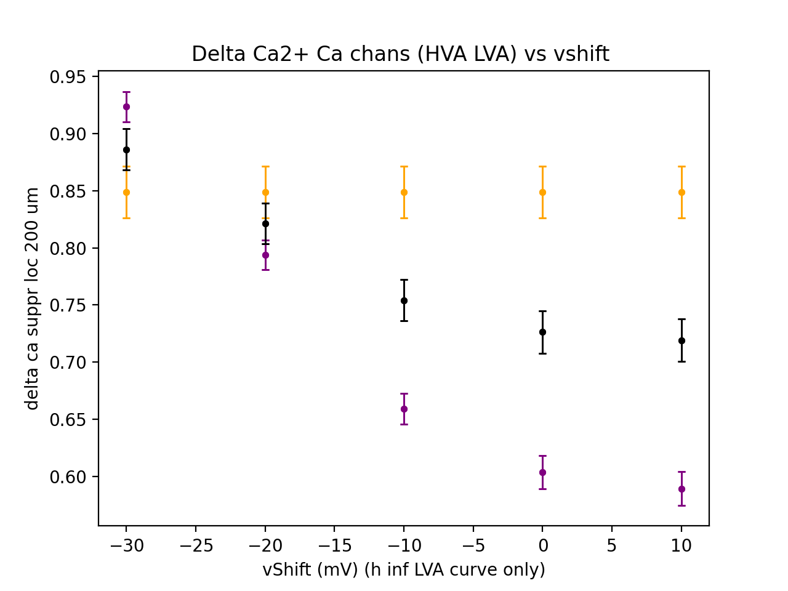

## Supplemental figures

The sh shell scripts generate data and figure subfolders of HVA and
LVA kinetics. To directly generate graphs of all channel properties
including the kinetics of the HVA and LVA (as shown in Supplemental
Figure 2A) you can run

    python3 -i compare_hva_lva.py

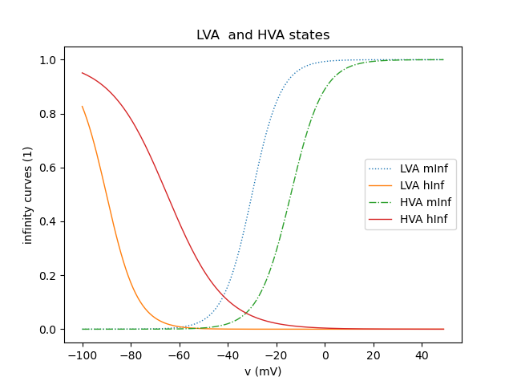

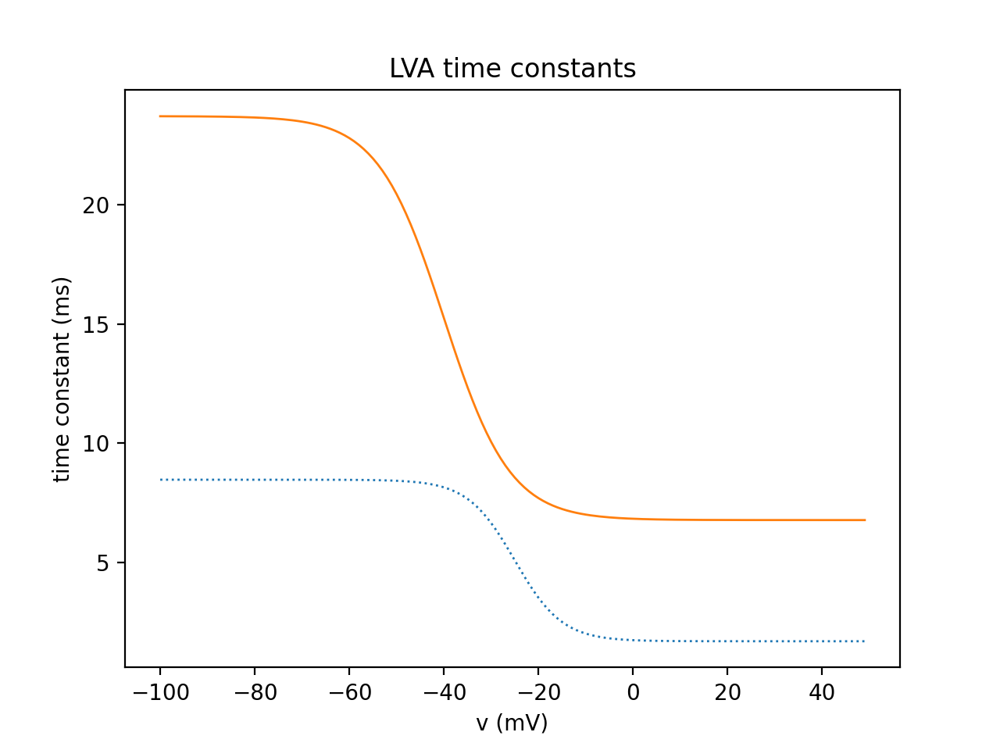

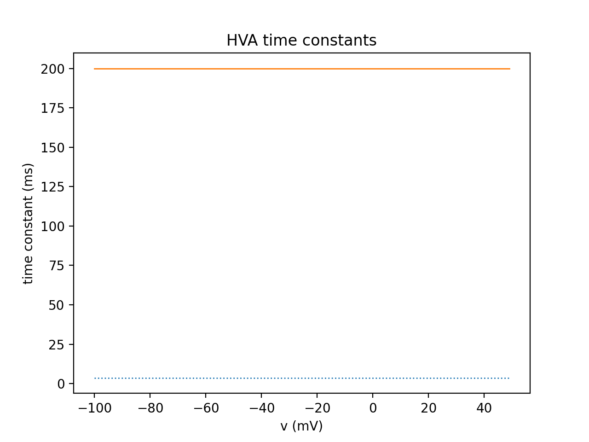

For a figure similar to suppl fig 2B run (requires
`sensitivity_depol_iclamp.sh` to be run first (see above)):

    python3 -i tGAR_block_deltaV.py

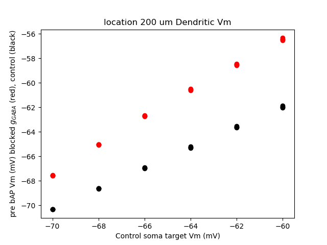

For sensitivity studies of Ca2+ suppression comparing blocked tonic
GABAAR and control cases as a function of Ca2+ channel kinetics
voltage shifting (of act and inact curves) run
(Make sure the amp_index setting at the end of
depol_iclamp.py is set to provide the pre-bAP baseline v that
you would like this study to take place with (e.g. 3 for -64 mV,
5 for -60 mV)) and that the appropriate lines in the below sh script
are commented/uncommented for which channel property you want to
explore(e.g. supplemental figure 2C) (took 17 minutes on 2019 MacBook):

    ./sensitivity_v_range_ca_chan_vshift_suppl.sh

and then the following can be run to plot the values (the below's `date_string`
variable needs to be set to the one in the `base_dir_name` set from
sensitivity_v_range_ca_chan_vshift.sh):

    python3 -i explore_ca_data_vshift_suppl.py

Note: as in figure 2C, the paper vshift was different than the
model parameter vshift which has negative values representing
depolarizing (shifts to the right) of the infinity curve:

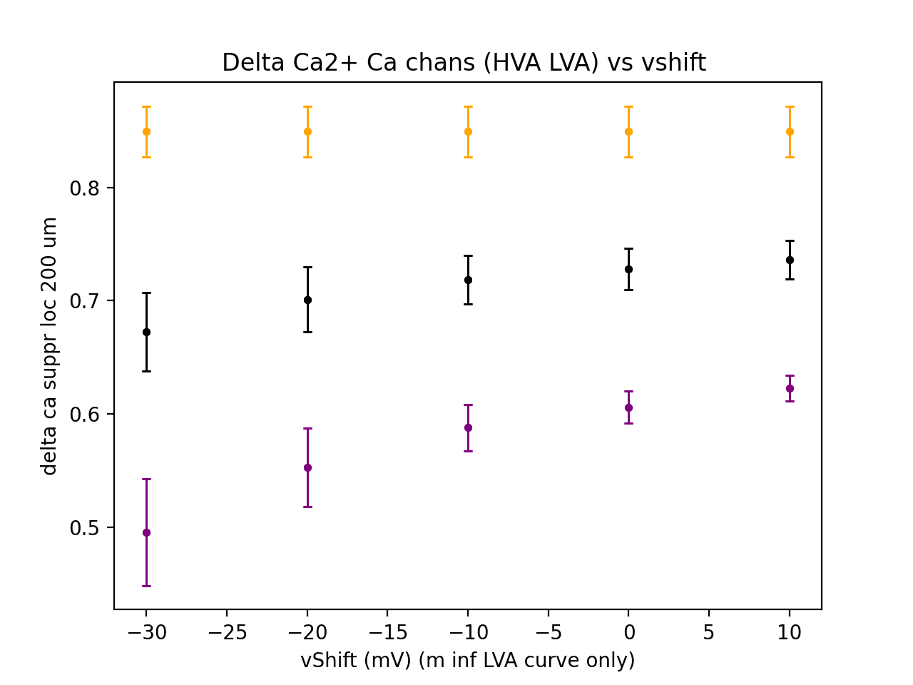

To recreate suppl figure 2D (takes 10 minutes on 2019 MacBook):

    ./sensitivity_range_bAP_stim.sh

and then

    python3 -i explore_ca_data_range_AP_current.py

Orange is HVA, purple is LVA, and black is average delta Ca2+
suppression (defined above):

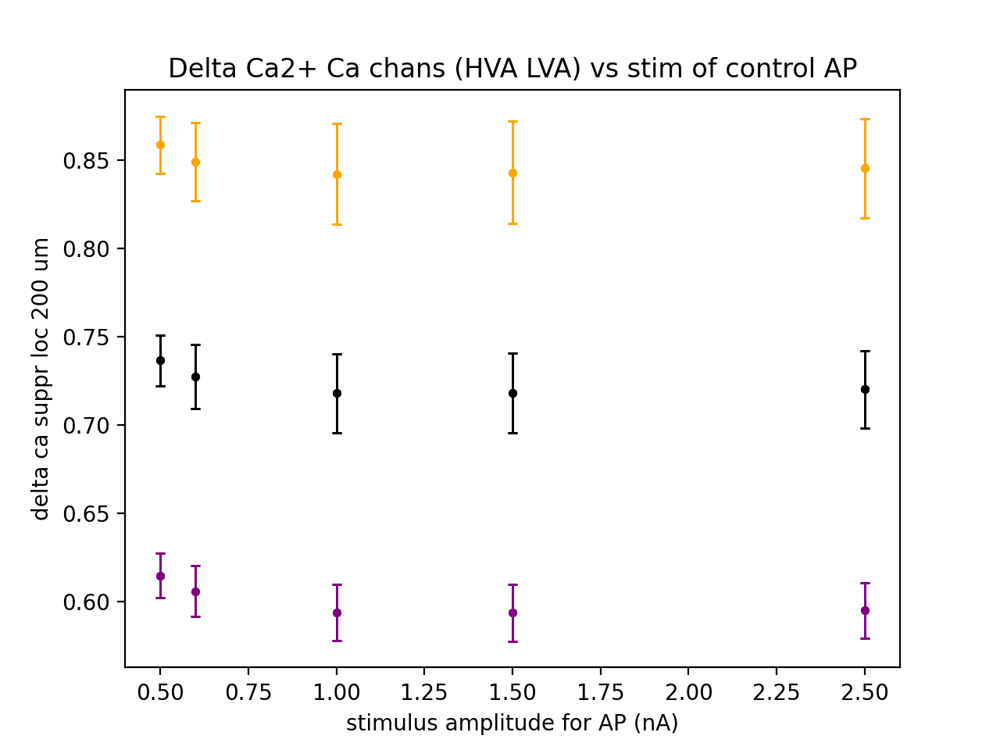

## general notes about output folders

Note there are extensive data and figure (fig) folders created with
the sensitivity scripts. The number and times of APs are written in
files in the `base_dir_name` folder in `num_of_APs.txt` and
`time_of_APS.txt`.  The numbers in the file have suffixes of the
program name that was running when the data was appended and an
amplitude index (amp_index) whose values indicate which target
control baseline voltage simulation the number and times of APs were
recorded from.  Currently the amplitude indicies of [0, 1, 2, 3, 4,
5] correspond to the baseline voltages of [-70, -68, -66, -64, -62,
-60] mV.

Note: to change the bAP stimulus current lines 41 in
`run_tGar_blocked` and 66 in `run_tGAR_control` need to have the
amplitude set.  The current turns off automatically once soma v
exceeds 0 mV so no time adjustment of IClamp is necessary.

Adjust base dir folder names (top dir folder names) in sensitivity
scripts to reflect which day you are using.  Don't change the rest
of the template dir names since the explore_.... py graphing
programs rely on those.  In `sensitivity_i_range_bAP.sh` you
need to change the base dir name in `setup_bAP_i_range.py`

## Notes for modifying batch (sh shell) scripts

Use the default constant or select a particular type of tonic GABAA
receptor distribution in `configure_sim.py` (or `configure_sim.py.orig`
if `sensitivity_depol_iclamp.sh` is used) then run sh scripts as
described in the "to generate figures in the paper" section at the
top of this readme.

The begining of the name of the output data directories (prefix) is
set in `sensitivity_depol_iclamp.sh` if that is run or just
`configure_sim.py` (which assigns the base_name_dir variable in
`base_dir_name.py`) if just `configure_and_run.sh` is run. `base_name_dir`
will determine where the figures and the data (their associated
traces) files are stored. The tonic GABAA receptor conductance
density (gbar) distribution (constant, ramp, or distal (plateau))
and the overall strength is also set in `configure_sim.py` After
`configure_sim.py` is run, the scripts `calc_ca_suppr.py` and
`figs_incl_suppl.py` read the `base_dir_name.py` file with an import
statement and then adds suffixes to the dir name to store the
figures and data.

It is also possible, of course, to execute one line
from `configure_and_run.sh` at a time as discussed here:

`configure_sim.py` does not run simulations, it
prepares the configuration of the simulation(s).

    python3 -i configure_sim.py

    python3 -i figs_incl_suppl.py

The above takes about a minute to run and generates all the
figures except (paper Fig 2B which shows) the relative
contributions of LVA and HVA to suppression of delta Ca (%
baseline).  To generate the calcium suppression figure:  

    python3 calc_ca_suppr.py 0

which will write images and data to the respective folders. You
can check what is new in your linux folder with a command that
lists the lasts things created at the bottom of the list such as:

    ls -lartd *

This takes about 30 seconds to run. Running this program
creates an output folder with suffix containing the delta Ca
(% baseline) graph.

Note: to see the results (delta Ca2+) run

    gimp (folder_name)*/*.png

where the folder_name built from the prefix in `base_dir_name.py`
was imported into `calc_ca_suppr.py`

The original Iascone et al 2020 readme follows.

This is the readme for the models associated with the paper:

> Iascone DM, Li Y, Sumbul U, Doron M, Chen H, Andreu V, Goudy F,
> Blockus H, Abbott LF, Segev I, Peng H, Polleux F (2020) Whole-Neuron
> Synaptic Mapping Reveals Spatially Precise Excitatory/Inhibitory
> Balance Limiting Dendritic and Somatic Spiking. Neuron
> 
> [http://dx.doi.org/https://doi.org/10.1016/j.neuron.2020.02.015](http://dx.doi.org/https://doi.org/10.1016/j.neuron.2020.02.015)
>
> This NEURON code was contributed by M Doron.
> 
> If you need additional help for your platform please consult: 
>
> [https://senselab.med.yale.edu/ModelDB/NEURON_DwnldGuide](https://senselab.med.yale.edu/ModelDB/NEURON_DwnldGuide)
>
> Compile the mod files as usual with a terminal command (or equivalent)
> 
> nrnivmodl mod_files
> 
> and then run the model with a command  
> python run_simulation.py  
> or  
> python3 run_simulation_python3.py
>
> Note: the python3 version was supplied by the ModelDB administrator.
